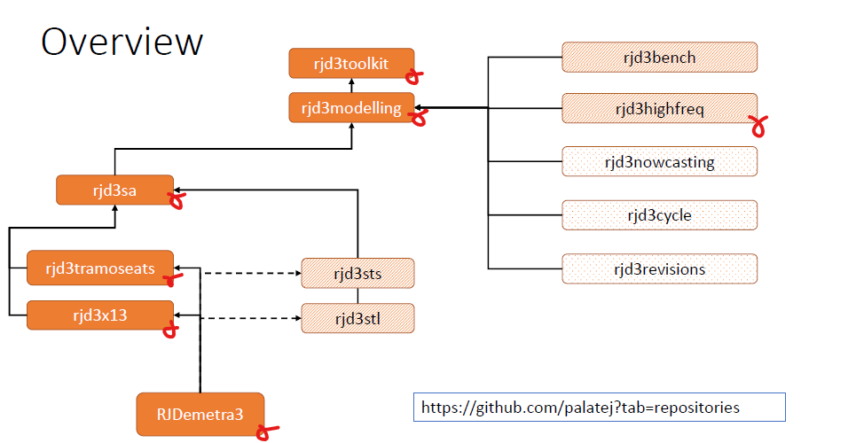

```{r setup, include=FALSE}
knitr::opts_chunk$set(echo = TRUE,
                      cache = F, 
                      fig.align = 'center',
                      fig.path = "img/markdown-")
library("knitr")
library("RJDemetra")
library("ggplot2")
library("rjd3toolkit")
library("rjd3modelling")
library("rjd3sa")
library("rjd3arima")
library("rjd3x13")
library("rjd3tramoseats")
library("rjdemetra3")
library("ggdemetra3")

fig.ext <- "pdf"
is_html <- knitr::is_html_output()
is_latex <- knitr::is_latex_output()
fig.ext <- "pdf"
if (is_html) {
    fa_arrow_circle_right <- '<i class="fas fa-arrow-circle-right"></i>'
    fa_r_project <- '<i class="fab fa-r-project"></i>'
} else {
    if (is_latex) {
        fa_arrow_circle_right <- "\\faIcon{arrow-circle-right}"
        fa_r_project <- "\\faIcon{r-project}"
        fa_java <- "\\faIcon{java}"
    } else {
        fa_arrow_circle_right <- "->"
        fa_r_project <- 'R'
    }
}
options(width = 60)
def.par <- par(no.readonly = TRUE)

```

# Introduction

### Outline of the webinar

        **(PUSH record button)**

Scope of the webinar: Seasonal Adjustment with X13-Arima and  Tramo-Seats
(leaving the rest aside...for future webinars ?)

Four presentations (approx 90')

-   P1: introduction 
      - highlighting the main evolutions between version 2 and 3
      - outlining the global scope of R tools for JDemetra+
      - working environment set-up 

-   P2: Focus on SA with X13-Arima or Tramo-Seats in R and related tools.

  **10' Coffee Break**

-   P3: Working in R with JDemetra+ workspaces

-   P4: Quality assessment and production in R

Resources on GitHub: slides, code, additional papers and beamers
<https://github.com/annasmyk/Tsace_RJD_Webinar_Dec22>

### JDemetra+: a library of algorithms for time series analysis

JDemetra+ is a library of algorithms on:

- Seasonal Adjustment (GUI and R)

- Trend and cycle estimation (R only)

- Benchmarking and temporal disaggregation (GUI and R)

- Bowcasting (R and Plug-in)

They can be accessed via graphical user-interface (GUI) and/or R and/or plug-ins. 

The available output, functions or tools are in general not identical using R or GUI for example, it is often fruitful to combine them. 

JDemetra+ also offers general utilities for time series analysis: tests, auto-correlation functions, arima modelling, spectral analysis tools ...(in GUI and R)

### Why R packages ? 

Before 2019: access only through GUI and plug-ins.

Why add R packages ? 

Allows to immerse JD+ algorithms in the R universe, with all its pre-existing statistical functions and user-community.

In March 2019, `RJDemetra` (containing X-13 Arima and Tramo-Seats) was published on CRAN:

-   first `r fa_r_project` package that enables to use Tramo-Seats

-   faster than existing `r fa_r_project` packages on seasonal adjustment

### Ever-growing R ecosystem

Since, many more packages have been developed as JDemetra+ Core was upgraded from version 2 to version 3

Extension of scope:

- High-frequency data (extended)

- STL

- refresh policies for SA 

- new tools 

Modifications of existing functions and output organisation


# Accessing JDemetra+ core routines: from V2 to v3

### From V2 to v3: changing gears 

**Version 2:** 

- RJDemetra (X13-Arima, Tramo-Seats, functions for workspace wrangling) 

- additionnal packages based on RJDemetra: rjdworkspace, ggdemetra, rjdqa (see paper on V2)

- more specific packatges like rjdhighfreq, rjdsts

(corresponding to the version 2.x family of JD+ Core)

**The mindset of version 3 is:** 

- modular organisation: independent more specific functions

- more "stand alone" tools (not only retrieving results from SA processing)


**Version 3:** A suite of packages (see below)

- corresponding to the version 3.x family of JD+ Core

- still under construction, moving perimeters

### Organisation of the rjd3 packages



### Seasonal adjustment algorithms in JDemetra+ version 3

For seasonal adjustment, specifically, JDemetra+ contains:

- X13-Arima (GUI and R)
- Tramo-Seats (GUI and R)
- STL (R only)
- Structural Time Series (SSF framework) (R only)

All of these algorithms can be used with HF data. 

For X13-Arima and Tramo-Seats some illustrations are available only in GUI. (auxiliary tools like: spectral analysis, sliding spans, revision history...)


Scope of this  webinar: SA with X-13 and Tramo-Seats, including HF data

# Setting up your work environment


### Installing packages (1/2)

Version 2: RJDemetra is on CRAN 
```{r, include=TRUE, eval=FALSE}
install.packages("RJDemetra")
library("RJDemetra")
```

In part 3 and 4 we will also use  

- JDCruncher (based on cruncher output)
To install it: download the **.zip** or **.tar.gz** file from <https://github.com/InseeFr/JDCruncheR/releases>. 

- rjdworkspace (based on RJDemetra)
To install it: download the **.zip** or **.tar.gz** file from <https://github.com/InseeFrLab/rjdworkspace/releases>. 

You can run v2 and v3 simultaneously

Version 3 requires Java `r fa_java` $\geq$ 17 
(see <https://github.com/jdemetra/rjdemetra/wiki/Installation-manual>)

### Installing packages (2/2)

Installing latest version from GitHub (as not on CRAN yet)

```{r, eval=FALSE}
# install.packages("remotes")
remotes::install_github("palatej/rjd3toolkit")
remotes::install_github("palatej/rjd3modelling")
remotes::install_github("palatej/rjd3sa")
remotes::install_github("palatej/rjd3arima")
remotes::install_github("palatej/rjd3x13")
remotes::install_github("palatej/rjd3tramoseats")
remotes::install_github("palatej/rjdemetra3")
remotes::install_github("palatej/rjdfilters")
remotes::install_github("palatej/rjd3sts")
remotes::install_github("palatej/rjd3highfreq")
remotes::install_github("palatej/rjd3stl")
remotes::install_github("palatej/rjd3bench")
remotes::install_github("AQLT/ggdemetra3") #additional graphics 
```

 