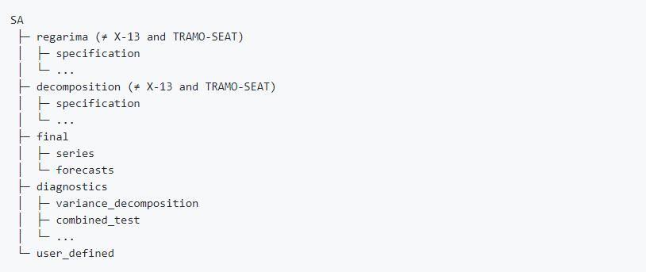

```{r setup, include=FALSE,eval=TRUE}
knitr::opts_chunk$set(echo = TRUE,
                      cache = F, 
                      fig.align = 'center',
                      fig.path = "img/markdown-")
library("knitr")
library("kableExtra")
library("microbenchmark")
library("ggplot2")
library("RJDemetra")
library("rjd3toolkit")
library("rjd3modelling")
library("rjd3sa")
library("rjd3arima")
library("rjd3x13")
library("rjd3tramoseats")
library("rjdemetra3")
library("ggdemetra3")

# library("rjd3sts")
# library("rjd3highfreq")

# library("rjd3bench")
fig.ext <- "pdf"
is_html <- knitr::is_html_output()
is_latex <- knitr::is_latex_output()
fig.ext <- "pdf"
if (is_html) {
    fa_arrow_circle_right <- '<i class="fas fa-arrow-circle-right"></i>'
    fa_r_project <- '<i class="fab fa-r-project"></i>'
} else {
    if (is_latex) {
        fa_arrow_circle_right <- "\\faIcon{arrow-circle-right}"
        fa_r_project <- "\\faIcon{r-project}"
        fa_java <- "\\faIcon{java}"
    }else {
        fa_arrow_circle_right <- "->"
        fa_r_project <- 'R'
    }
}
options(width = 60)
def.par <- par(no.readonly = TRUE)
```

```{r, eval=TRUE, echo=FALSE}
ipi <- read.csv2("../Data/IPI_nace4.csv")
ipi$date <- as.Date(ipi$date, format = "%d/%m/%Y")
ipi[, -1] <- sapply(ipi[, -1], as.numeric)
# creating a TS object from a data frame 
y_raw <- ts(ipi[, "RF3030"], frequency = 12, start = c(1990, 1), end = c(2019, 6))
y_new <- ts(ipi[, "RF3030"], frequency = 12, start = c(1990, 1), end = c(2019, 9))


```

# Introduction 

### Seasonal adjustment: common steps 

- testing for seasonality (identify seasonal patterns for HF data)
- pre-treatment 
- create customisezd variables for pre-treatment (e.g calendar regressors)
- decomposition 
- retrieve output series 
- retrieve diagnostics 
- customize parameters 
- refresh data
- ...
- repeat..

This presentation will illustrate all this points, mainly in X13-Arima.

### Context of use

Producing Seasonally adjusted series in R
(with parameters customized according to needs and previous diagnostics) 

- not being aware of JD+ GUI existence

- no workspace structure of data

- time series objects in R

- use exclusively JD+ algorithms and no other SA R packages (Seasonal, TBATS...)

All the examples are related to ONE series. For an entire data set you can of course use 
loops or `lapply()` type of functions 

# X13 (...and some Tramo-Seats)

## Quick Launch with default specifications 

### Running a Seasonal Adjustment processing {.allowframebreaks} 

In version 2
\footnotesize
```{r,eval=TRUE, include=TRUE}
# X13
sa_x13_v2 <- RJDemetra::x13(y_raw, spec = "RSA5c")
# see help pages for default spec names, identical in v2 and v3
#Tramo-Seats
sa_ts_v2 <- RJDemetra::tramoseats(y_raw, spec = "RSAfull")
```

In version 3 (printed model identical to v2)
\footnotesize
```{r,eval=TRUE, include=TRUE}
#X13
sa_x13_v3 <- rjd3x13::x13(y_raw, spec = "RSA5")
sa_x13_v3

#Tramo seats
sa_ts_v3 <- rjd3tramoseats::tramoseats(y_raw, spec = "RSAfull")

```

### Running only pre-adjustment
In version 2
\footnotesize
```{r,eval=FALSE, include=TRUE}
# Reg-Arima part from X13 only (different default spec names, cf help pages)
regA_v2 <- RJDemetra::regarima_x13(y_raw, spec = "RG5c")

# Tramo only 
tramo_v2 <- RJDemetra::regarima_tramoseats(y_raw,spec = "TRfull")
```

In version 3 (not very different)
\footnotesize
```{r,eval=FALSE, include=TRUE}
#X13
sa_regarima_v3 <- rjd3x13::regarima(y_raw, spec = "RG5c")

#Tramo seats 
#sa_tramo_v3 <- rjd3tramoseats::tramo(y_raw, spec = "TRfull")

# "fast." versions...(just results, cf output structure)
```

### Running only decomposition

In version 2
\footnotesize
```{r,eval=FALSE, include=TRUE}
# X11 (spec option)
X11_v2 <- RJDemetra::x13(y_raw, spec = "X11")

#Tramo-Seats ? you 
#sa_ts_v2<-RJDemetra::tramoseats(y_raw, spec = "RSAfull")
```

In version 3
\footnotesize
```{r,eval=FALSE, include=TRUE}
#X11
x11_v3 <- rjd3x13::x11(y_raw) # specific function
#Seats: you need an arima model
```

## Retrieving output and data visualization

### "Model_sa" object structure in version 2 (1/2)

"Model_sa" is the resulting object of the estimation, it contains 

- raw series  
- parameters (specification)  
- output series 
- diagnostics 

All arranged in a specific way

\footnotesize
```{r,eval=FALSE, include=TRUE}
# v2 "output"
Model_sa <- RJDemetra::x13(y_raw, spec = "RSA5")

Model_sa$regarima
Model_sa$decomposition
#...
```

### "Model_sa" object structure  in version 2
Organised by domain:

 {width=90%}


### "Model_sa" object structure  in version 3

Results vs specification...and then by domain

\footnotesize
```{r,eval=FALSE, include=TRUE}
# Model_sa = sa_x13_v3
sa_x13_v3 <- RJDemetra::x13(y_raw, spec = "RSA5")
sa_x13_v3$result
sa_x13_v3$estimation_spec
sa_x13_v3$result_spec
sa_x13_v3$user_defined
```


### Differences from version 2 to version 3

In version 3

- specification is separated from results

- results are more specific ("X11" like series names in X13-Arima) 

- specifications are directly (no extraction function needed like in v2) 

- two concepts of spec : estimation spec (domain) and result spec (point) in v3 

- in v2 only only result spec (more about this in refresh section)

### Retrieve output series 

Input and output series are TS objects in R
(not when using specific extensions for HF data)

- final series: different names and layout from v2 to v3

\footnotesize
```{r,eval=FALSE, include=TRUE}
# Version 2 : display of Main Results table (from GUI) 
sa_x13_v2$final$series #y, sa,t,s,i
sa_x13_v2$final$forecasts

# Version 3 
# final seasonally adjusted series
sa_x13_v3$result$final$d11final


```

In version 3 much more series are available without using the user-defined output option.

### Series from preadjustment

\footnotesize
```{r,eval=FALSE, include=TRUE}
# Version 2 
sa_x13_v2$regarima$model$effects #MTS object

# forecast accessible only via user defined output (cf below)

# Version 3: "x11 names" : preadjustement effets as stored in the A table
# add doc on names   
sa_x13_v3$result$preadjust$a6
```

### Series from decomposition

In version 2
- D tables accessible via user-defined output,
- forecast series accessible only via user defined output (cf below)

In  Version 3: "x11 names" 
\footnotesize
```{r,eval=FALSE, include=TRUE}
# Version 3  
sa_x13_v3$result$decomposition$d5 # tables from D1 to D13
```


### Retrieving Diagnostics

Just fetch the needed objects in the relevant part of the output structure or print the whole "model"

```{r,eval=FALSE, include=TRUE}
# Version 2 
print(sa_x13_v2)
sa_x13_v2$decomposition$mstats
sa_x13_v2$decomposition$s_filter
sa_x13_v2$decomposition$t_filter

# version 3 (more diagnostics available by default)
print(sa_x13_v2)
sa_x13_v3$result$diagnostics$td.ftest.i
```

What is missing (series or diagnostics) can be retrieved adding user-defined output in the options 


### Retrieving user defined-output (1/2)

In version 2 or version 3: first define the vector of objects you wish to add

Lists of avaible diagnostics or series 

\footnotesize
```{r,eval=FALSE, include=TRUE}
# Version 2 
user_defined_variables("X13-ARIMA") 
user_defined_variables("TRAMO-SEATS")

# Version 3: more specific functions 
userdefined_variables_tramoseats("tramoseats")
userdefined_variables_tramoseats("tramo") # restriction

userdefined_variables_x13("regarima") #restriction
userdefined_variables_x13()
```

### Retrieve user defined-output (2/2)

Select the objects and customize estimation function
(identical in v2 and v3)

\footnotesize
```{r,eval=TRUE, include=TRUE}
# version 3
ud <- userdefined_variables_x13()[15:17] # b series
ud
sa_x13_v3_UD <- rjd3x13::x13(y_raw, "RSA5c", userdefined = ud)
sa_x13_v3_UD$user_defined # remainder of the names 
# retrieve the object 
sa_x13_v3_UD$user_defined$decomposition.b1
```


### Plots and data visualisation in version 2 {.allowframebreaks} 

In version 2 three kinds of plots: 

- final (2 types: plots identical to GUI main results)
- regarima residuals (6 plots)
- SI ratios 

### Plots and data visualisation in version 2 {.allowframebreaks} 

\footnotesize
```{r,eval=TRUE, include=TRUE}
# Version 2
# for class 'final' : 2 types 
plot(sa_x13_v2, type_chart = "sa-trend", first_date = c(2015, 1))
#plot(sa_x13_v2, type = "cal-seas-irr", first_date = c(2015, 1))
```

### Plots and data visualisation in version 2 {.allowframebreaks} 

```{r, include=TRUE, eval=TRUE}
# regarima
layout(matrix(1:6, 3, 2))
plot(sa_x13_v2$regarima, ask = FALSE)
# Plotting SI ratios  
plot(sa_x13_v2$decomposition, first_date = c(2015, 1))
```

### Plots and data visualisation in version 2 {.allowframebreaks} 

```{r, include=TRUE, eval=TRUE}
# Plotting SI ratios  
plot(sa_x13_v2$decomposition, first_date = c(2015, 1))
```

### Plots and data visualisation in version 3 {.allowframebreaks} 

In version 3 

- final + NEW "autoplot" layout 

- regarima not available (yet ?)

- SI ratios + NEW ggplot layout 

\footnotesize
```{r,eval=TRUE, include=TRUE}
# version 3
# remotes::install_github("AQLT/ggdemetra3", INSTALL_opts = "--no-multiarch")
library("ggdemetra3")
ggdemetra3::siratioplot(sa_x13_v3)
```

### Plots and data visualisation in version 3 {.allowframebreaks} 

```{r,eval=TRUE, include=TRUE}
# version 3
ggdemetra3::ggsiratioplot(sa_x13_v3)
```

### Plots and data visualisation in version 3 {.allowframebreaks} 

```{r,eval=TRUE, include=TRUE}
# version 3
ggplot2::autoplot(sa_x13_v3)
```

## Customizing specifications

### Customizing specifications: general steps 

To customize a specification you must 

- start with a valid specification, usually one of the default specs (equivalent to cloning a spec in GUI)

- create a new specification

- apply the new specification to your raw series 

Some differences between v2 and v3

### Customizing specifications in version 2

Direct parameter modification as arguments of the specification function 

\footnotesize
```{r,eval=FALSE, include=TRUE}
# version 2
# changing estimation span, imposing additive model and
#adding user defined ouliers 
# first create a new spec modifying the previous one 
spec_1 <- x13_spec(sa_x13_v2)
spec_2 <- x13_spec(spec_1, estimate.from = "2004-01-01",
                  usrdef.outliersEnabled = TRUE,
                             usrdef.outliersType = c("LS", "AO"),
                             usrdef.outliersDate = c("2008-10-01", "2018-01-01"),
                             transform.function = "None") # additive model
# here the reg-arima model will be estimated from  "2004-01-01" 
# the decomposition will be run on the whole span 

# new sa processing
sa_x13_v2_2 <- RJDemetra::x13(y_raw, spec_2)
sa_x13_v2_2$final$series

```


### Customizing specifications in version 3 

Use direct and specific `set_` functions 
- for the preprocessing step (functions defined in `rjd3modelling`):

`set_arima()`, `set_automodel()`, `set_basic()`, `set_easter()`, `set_estimate()`, `set_outlier()`, `set_tradingdays()`, `set_transform()`, `add_outlier()` and `remove_outlier()`, `add_ramp()` and `remove_ramp()`, `add_usrdefvar()`

- for the decomposition step in X13 (function defined in `rjd3x13`):
 `set_x11()`
 
- for the decomposition step in Tramo-Seats (function defined in `rjd3tramoseats`):
 `set_seats()`
 
- for the benchmarking step (function defined in `rjd3modelling`):
 `set_benchmarking()`

Benchmarking New v3 feature, same options available as in GUI.

### Customizing specifications in version 3: example

\footnotesize
```{r,eval=FALSE, include=TRUE}
# start with default spec 
spec_1 <- spec_x13_default("RSA3")
# or start with existing spec (no extraction function needed)
spec_1 <- sa_x13_v3_UD$estimation_spec

# set a new spec
## add outliers 
spec_2 <- rjd3modelling::add_outlier(spec_1,
                  type = c("AO"), c("2015-01-01", "2010-01-01"))
## set trading days
spec_2 <- rjd3modelling::set_tradingdays(spec_2,
                  option = "workingdays" )
# set x11 options 
spec_2 <- set_x11(spec_2, henderson.filter = 13)
# apply with `fast.x13` (results only)
fast.x13(y, spec_2)

```


### Adding user-defined regressors

Differences:

In version 2: regressors added directly to the specification 

In version 3: new notion of "context": an additional concept designed to add any user defined (non standard, e.g non outlier") variable 

### Adding user-defined regressors in v2

\footnotesize
```{r,eval=FALSE, include=TRUE}
# defining user defined trading days 
spec_td <- x13_spec(spec_1,
tradingdays.option = "UserDefined",
tradingdays.test ="None",
usrdef.varEnabled = TRUE,
# the user defined variable will be assigned to the calendar component
usrdef.varType="Calendar",
usrdef.var=td_regs ) # regressors have to be a single or multiple TS 
# new sa processing
sa_x13_v2_4 <- x13(y_raw, spec_td)
# user defined intervention variable  
spec_int <- x13_spec(spec_1,
                   usrdef.varEnabled = TRUE,
                   # the user defined variable will be assigned to the trend component
                   usrdef.varType = "Trend",
                   usrdef.var = x ) # x has to to be a single or multiple TS 
# new sa processing
sa_x13_v2_5 <- x13(y_raw, spec_int)
```

### Adding user-defined regressors in version 3

\footnotesize
```{r,eval=FALSE, include=TRUE}
# define a user defined trading days regressor 
td_reg1 <- rjd3modelling::td(12, start = start(y_raw), length = length(y_raw), groups = c(1, 1, 1, 1, 1, 0, 0))

# define a context
my_context <- rjd3modelling::modelling_context(variables = list(a = xvar))

# set a new specification from a default specification
spec_td <- rjd3x13::spec_regarima_default(name = "rg3") |>
  rjd3modelling::add_usrdefvar(id = "r.a")

# new reg-arima estimation
reg_a_estimation <- rjd3x13::regarima(window(ts, start = 1985, end = 2013), spec_td, context = my_context)
```

## Refreshing data 

### Refreshing data: Estimation_spec vs result_spec (1/2)

Possibility of refreshing data is a NEW feature of version 3.

In the "sa_model" object generated by the estimation process:

- specification is separated from results 

- split in "estimation_spec" (domain spec): set of customizable constraints

- and "result_spec" (point spec)
    
\footnotesize
```{r, eval=FALSE, include=TRUE}
sa_x13_v3$estimation_spec$regarima$arima
```

    - result spec (or point spec)
\footnotesize    
```{r, eval=FALSE, include=TRUE}
sa_x13_v3$result_spec$regarima$arima
```

### Estimation_spec vs result_spec

- in v2 could only retrieve a (point) result_spec (extracted with `x13_spec()` for example) 

- in v3 your are able to re-estimate the "result_spec" inside a domain of constraints (estimation spec), freeing restrictions on selected parameters: just like in GUI, or Cruncher.

### Steps for refreshing data

\footnotesize
```{r,eval=FALSE, include=TRUE}

current_result_spec <- sa_x13_v3$result_spec
current_domain_spec <- sa_x13_v3$estimation_spec

# generate NEW spec for refresh 
refreshed_spec <- x13.refresh(current_result_spec, # point spec to be refreshed
            current_domain_spec, #domain spec (set of constraints)
            policy = "Outliers",
            period = 12, # monthly series
            start = "2017-01-01",
            end = NULL)

# apply the new spec on new data : y_new= y_raw + 1 month

sa_x13_v3_refresh <- x13(y_new, refreshed_spec)

```

Outliers identification : more flexible than "last outliers" or "all outliers" in v2, here the span can be customized .

(Warning: x13.refresh hasn't been thoroughly tested yet)

### Refresh Policies 

- "FreeParameters" : all reset to default
- "Complete": all reset to default but user defined stored
- "Outliers_StochasticComponent" 
- "Outliers"
- "FixedParameters" 
- "FixedAutoRegressiveParameters" (for Seats)
- "Fixed"


# SA of High-Frequency data 

### SA of High-Frequency data (1/2)

Specificity: high-frequency data can display multiple and non integer periodicities:

For example a daily series might display 3 periodicities:
- weekly ($p=7$):  Mondays are alike and different from Sundays (DOW)
- intra-monthly ($p=30.44$):  the last days of each month are different from the first ones (DOM)
- yearly ($p=365.25$):  from on year to another the 15th of June are alike, summer days are alike (DOY)

Two classes of solutions:
- round periodicities (might involve imputing data) (extended STL,..)
- use approximations for fractional backshift powers (extended X13-Arima and Tramo-Seats)

### SA of High-Frequency data (2/2)

- Specific tools:  
  rjd3highfreq and rjd3stl (version 3)
(version 2 : rjdhighfreq)

Different data format: numeric vectors (and NOT TS objects)

- linerarization with **fractional airline model** (correction for calendar effects and outlier detection)

- iterative decomposition (extended X-11 and Seats) starting with the highest frequency 

(See presentation about rjd3highfreq in Webinar GitHub Repo)

### Linearization: code template

\footnotesize
```{r, eval=FALSE,include=TRUE}
rjd3highfreq::fractionalAirlineEstimation
                        (df_daily$log_births, # here series in log
                x = q, # q= calendar
                periods = 7, # approx  c(7,365.25)
                ndiff = 2, ar = FALSE, mean = FALSE,
                outliers = c("ao","wo","LS"), 
                # WO compensation
                criticalValue = 0, # computed in the algorithm
                precision = 1e-9, approximateHessian = TRUE)
                    
# calendar regressors can be defined with the rjd3modelling package 

```
See {rjd3highfreq} help pages

### Decomposition with extended X-11: code template

\footnotesize 
```{r, eval=FALSE,include=TRUE}
#step 1: p=7
x11.dow <- rjd3highfreq::x11(exp(pre.mult$model$linearized),
        period = 7,                 # DOW pattern
        mul = TRUE,                              
        trend.horizon = 9,  # 1/2 Filter length : not too long vs p
        trend.degree = 3,                         # Polynomial degree
        trend.kernel = "Henderson",               # Kernel function
        trend.asymmetric = "CutAndNormalize",     # Truncation method
        seas.s0 = "S3X9", seas.s1 = "S3X9",       # Seasonal filters
        extreme.lsig = 1.5, extreme.usig = 2.5)   # Sigma-limits
#step 2: p=365.25
x11.doy <- rjd3highfreq::x11(x11.dow$decomposition$sa,  # previous sa
                    period = 365.2425,         # DOY pattern
                    mul = TRUE) #other parameters skipped here
```


### Decomposition with extended Seats: code template

\footnotesize
```{r, eval=FALSE,include=TRUE}
#step 1: p=7
#step 2: p=365.25
amb.doy <- rjd3highfreq::fractionalAirlineDecomposition(
  amb.dow$decomposition$sa,  # DOW-adjusted linearised data
  period = 365.2425,         # DOY pattern
  sn = FALSE,                # Signal (SA)-noise decomposition 
  stde = FALSE,              # Compute standard deviations
  nbcasts = 0, nfcasts = 0)  # Numbers of back- and forecasts
```

# Generating User-defined auxilary variables 

## Calendars

### Calendars 

New features of version 3: 

- generating calendars in R (see GUI function in v2)

- generating calendar regressors
  - raw number of days or contrasts
  - long term mean correction or not
  - user-defined groups of days 
  - user-defined contrast days (associated with holidays)


Can be done with rjd3modelling package


### Creation of a specific calendar

\footnotesize
```{r}
library("rjd3modelling")
# French
fr_cal <- calendar.new()
calendar.holiday(fr_cal, "NEWYEAR")
calendar.holiday(fr_cal, "EASTERMONDAY")
calendar.holiday(fr_cal, "MAYDAY")
calendar.fixedday(fr_cal, month = 5, day = 8,
                  start = "1982-01-01")
# calendar.holiday(fr_cal, "WHITMONDAY") # Equivalent to:
calendar.easter(fr_cal, offset = 61)

calendar.fixedday(fr_cal, month = 7, day = 14)
# calendar.holiday(fr_cal, "ASSUMPTION")
calendar.easter(fr_cal, offset = 61)
calendar.holiday(fr_cal, "ALLSAINTSDAY")
calendar.holiday(fr_cal, "ARMISTICE")
calendar.holiday(fr_cal, "CHRISTMAS")
```


### Creation of a associated regressors  {.allowframebreaks}


Use `holidays()` to get the days of the holidays and `htd()` to get the trading days regressors

\footnotesize
```{r}
holidays(fr_cal, "2020-12-24", 10,single = T)
s <- ts(0, start = 2020, end = c(2020, 11), frequency = 12)
# Trading-days regressors (each day has a different effect, sunday as contrasts)
td_reg <- htd(fr_cal, s = s, groups = c(1, 2, 3, 4, 5, 6, 0))
# Working-days regressors (Monday = ... = Friday; Saturday = Sunday = contrasts)
wd_reg <- htd(fr_cal, s = s, groups = c(1, 1, 1, 1, 1, 0, 0))
# Monday = ... = Friday; Saturday; Sunday = contrasts
wd_reg <- htd(fr_cal, s = s, groups = c(1, 1, 1, 1, 1, 2, 0))
wd_reg
# Monday = ... = Wednesday; Thursday; Friday = contrasts
wd_reg2 <- htd(fr_cal, s = s, groups = c(1, 1, 1, 2, 0, 1, 1))
wd_reg2
```


## Outliers and intervention variables 

### Outliers and intervention variables 

New feature of version 3 allows to create: 

- outliers regressors (AO, LS, TC, SO, Ramp (quadratic to be added)
- trigonometric variables

### Example of outliers {.allowframebreaks} 

\footnotesize
```{r outplot}
s <- ts(0, start = 2000, end = 2005, frequency = 12)
ao <- ao.variable(s = s, date = "2001-03-01")
ls <- ls.variable(s = s, date = "2001-01-01")
tc <- tc.variable(s = s, date = "2001-01-01", rate = 0.7) # Customizable rate
so <- so.variable(s = s, date = "2003-05-01")
ramp <- ramp.variable(s = s, range = c("2001-01-01","2001-12-01"))
plot(ts.union(ao, ls, tc, so, ramp), plot.type = "single",
     col = c("red","lightgreen","orange","blue","black"))
```

# Time series tools 

### Time series tools: NEW features in version 3

The spirit of version 3 is to offer more tools from JDemetra+ libraries such as:

- tests (seasonality, normality, randomness, residual trading dayseffects) in rjd3tookit, rjd3modelling and rjd3sa packages

- autocorrelation functions (in rjd3toolkit), incl partial and inverse

- arima model estimation and decomposition (rjd3modelling)

- aggregation to higher frequency (`rjd3toolkit::aggregate()`)


More flexibility for the user as they can be applied any time not just as part of an SA processing.

Some of might also be available in other R packages. Arima model estimation is notoriously faster than other R functions.


### Testing for seasonality

In rjd3sa:

- Canova-Hansen (`seasonality.canovahansen()`) spctral, allows identifying patterns in HF data

- X-12 combined test (`seasonality.combined()`)

- F-test on seasonal dummies (`seasonality.f()`)

- Friedman Seasonality Test (`seasonality.friedman()`)

- Kruskall-Wallis Seasonality Test (`seasonality.kruskalwallis()`)

- Periodogram Seasonality Test (`seasonality.periodogram()`)

- QS Seasonality Test (`seasonality.qs()`)

### Arima estimation 

\footnotesize
```{r, include=TRUE, eval=FALSE}
# JD+
print(system.time(
    for (i in 1:1000) {  
      j <- rjd3modelling::sarima.estimate(
        data = log(rjd3toolkit::ABS$X0.2.09.10.M), 
        order = c(2, 1, 1), seasonal = list(order = c(0, 1, 1), period = 12))
    }))
#       user    system        elapsed (in seconds) 
#      4.98        0.37        4.63 

#R-native
print(system.time(
  for (i in 1:1000) {  
    r <- arima(
      x = log(rjd3toolkit::ABS$X0.2.09.10.M), 
      order = c(2, 1, 1), seasonal = list(order = c(0, 1, 1), period = 12))
  }))
#       user    system        elapsed (in seconds) 
#     158.74        0.23      160.49 

print(j$likelihood )
print(r)
```


# Conclusion 

### SA in R: What's new in v3 ? 

Tests and time series tools

General and flexible defintion of 

    - calendars
    
    - auxilary variables

Refresh Policies

Direct setting of basic benchmarking

