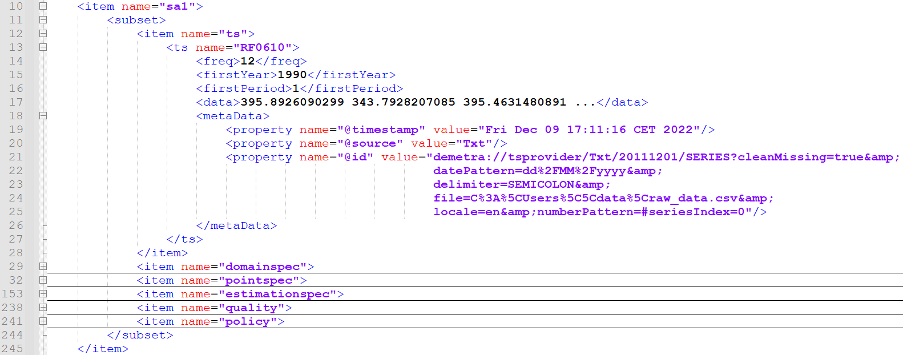

```{r setup, include=FALSE}
knitr::opts_chunk$set(echo = TRUE, 
                      eval = FALSE, 
                      cache = F, 
                      fig.align = 'center',
                      fig.path = "img/markdown-")
library("knitr")
library("kableExtra")
library("microbenchmark")
library("ggplot2")
library("rjd3toolkit")
library("rjd3modelling")
library("rjd3sa")
library("rjd3arima")
library("rjd3x13")
library("rjd3tramoseats")
library("rjdemetra3")
library("ggdemetra3")

# library("rjd3sts")
# library("rjd3highfreq")

# library("rjd3bench")
fig.ext <- "pdf"
is_html <- knitr::is_html_output()
is_latex <- knitr::is_latex_output()
fig.ext = "pdf"
if (is_html) {
    fa_arrow_circle_right <- '<i class="fas fa-arrow-circle-right"></i>'
    fa_r_project <- '<i class="fab fa-r-project"></i>'
} else {
    if (is_latex) {
        fa_arrow_circle_right <- "\\faIcon{arrow-circle-right}"
        fa_r_project <- "\\faIcon{r-project}"
        fa_java <- "\\faIcon{java}"
    } else {
        fa_arrow_circle_right <- "->"
        fa_r_project <- 'R'
    }
}
options(width = 60)
def.par <- par(no.readonly = TRUE)
```

# Introduction

## Context

-   in R we don't need a workspace stucture to run an SA process (cf P2)

-   we could think SA processing with JD+ algorithms can happen in two disntict
    worlds

    -   graphical user interface (GUI) and cruncher using workspaces

    OR

    -   R functions (without workpaces, TS object or numeric vectors for HF)

Still there are benefits in using workspaces and R packages in conjunction

We will highlight them in the remaining of this presentation

### Workspace structure

-   a workspace is a JD+ specific data structure (XML files) which allows to use
    the GUI and cruncher

Workspaces have two diserable properties:

-   reading by GUI (1)
-   refreshing (with new raw data for example) by GUI or cruncher (2)

If a workspace doesn't contain the sufficient metadata (path to the raw data),
only the first property (1) will be available.

### SA-item in XML files



# Using workspaces and R packages in conjuction

### Using workspaces and R packages in conjuction

Two principal classes of benefits:

-   instant reading: immersing results in the R world (functions, plots..)
-   automating potential manual operations for large datasets

### Packages operating on workspaces

We will use the packages [**RJDemetra**](https://github.com/jdemetra/rjdemetra),
[**rjdemetra3**](https://github.com/palatej/rjdemetra3) and
[**rjdworkspace**](https://github.com/InseeFrLab/rjdworkspace).

The packages are availiable here:

-   [**RJDemetra**](https://github.com/jdemetra/rjdemetra) on
    [CRAN](https://cran.r-project.org/web/packages/RJDemetra/index.html) or
    <https://github.com/jdemetra/rjdemetra>
-   [**rjdemetra3**](https://github.com/palatej/rjdemetra3) on
    <https://github.com/palatej/rjdemetra3>
-   [**rjdworkspace**](https://github.com/InseeFrLab/rjdworkspace) on
    <https://github.com/InseeFrLab/rjdworkspace>.

To install it use the following code:

\footnotesize
```{r, eval = FALSE}
# If devtools is not installed
# install.packages("devtools")
library("devtools")

install.packages("RJDemetra")
install_github("https://github.com/palatej/rjdemetra3")
install_github("https://github.com/InseeFrLab/rjdworkspace")
```

# Instant reading

### Instant reading of workspaces

I a workspace, we read:

-   output series
-   parameters
-   diagnostics

Thanks to R packages, no export + import but directly:

-   import in R physical workspaces
-   automatic and chain reading --\> many series and quickly
-   make faster comparison

### Instant reading in v2

In [**RJDemetra**](https://github.com/jdemetra/rjdemetra) (v2), the function
`RJDemetra::load_workspace()` creates a connection between a physical workspace
and a R object and allows to read every multiprocessing and SA-items.

Code example:

\footnotesize
```{r, eval = FALSE}
ws <- RJDemetra::load_workspace("./WS_input/WS_simple.xml")
RJDemetra::compute(ws)

mp_1 <- RJDemetra::get_object(ws, pos = 1)
sa_item_1 <- RJDemetra::get_object(mp_1, pos = 1)
model_sa_1 <- RJDemetra::get_model(sa_item_1, workspace = ws)
```

\normalsize
Later we will produce the same workspace result with [**RJDemetra**](https://github.com/jdemetra/rjdemetra) in the **[Reproduce workspace]** section.

### Instant reading in v3

In [**rjdemetra3**](https://github.com/palatej/rjdemetra3) (v3), the function
`rjdemetra3::load_workspace` imports directly in our R working directory all the
informations (multiprocessing, SA-item...) in a R object (list).

Code example:

\footnotesize
```{r, eval = FALSE}
ws <- rjdemetra3::load_workspace("./WS_input/WS_simple.xml")
```

\normalsize
This single line does the same job as the previous 5 of version 2.

Today, the connection between R packages v3 and the workspace structure is under
construction.

There are no functions yet to navigate this object. So from now on, I will only
present the functions of version 2.

# Automating operations

### Automating operations on workspaces

Goals:

-   produce and reproduce the workspace structure without the JDemetra+ GUI but
    with R
-   keep the reading, writing and refreshing properties both by the graphical
    interface and by the cruncher
-   enable dynamic updates of physical workspaces with R

### Outline of the automation

Different kind of operations possible in R:

-   creation of workspaces, multiprocessing and SA-item
-   export and write a workspace (physical XML files)
-   modification / dynamic update with one or several workspaces

## Creation

### Creation of a workspace

[**RJDemetra**](https://github.com/jdemetra/rjdemetra)
has a collection of functions to create a workspace and each element
(multiprocessing, SA-item...) and to bring it together:

-   create a *virtual* workspace: `RJDemetra::new_workspace()`
-   create a *virtual* multiprocessing: `RJDemetra::new_multiprocessing()`
-   create a specification, there are several functions depending on the
    method: `RJDemetra::x13_spec(), RJDemetra::tramoseats_spec()...`
-   create an SA-item, there are several functions depending on the chosen
    specification: `RJDemetra::x13(), RJDemetra::tramoseats()...`
-   Finally to bring the elements together, you can use
    `RJDemetra::add_sa_item()` to add the created SA-item to a multprocessing in
    your workspace

*virtual object = composed of R object*

### Reproduce workspace

Here we reproduce the SA-item read in the **[Instant reading in v2]** section


\footnotesize
```{r, eval = FALSE}
# Data preparation
raw_data <- read.csv2("./data/raw_data.csv", dec = ".") |> 
    ts(start = 1990, frequency = 12)

# Create WS
ws <- RJDemetra::new_workspace()
mp_1 <- RJDemetra::new_multiprocessing(workspace = ws, 
                                       name = "SAProcessing-1")
spec_x13 <- RJDemetra::x13_spec(spec = "RSA3")
model_sa_1 <- RJDemetra::x13(raw_data, spec = spec_x13)
```

## Export

For the export part, the function `RJDemetra::save_workspace()` exports and
creates a workspace (XML files).

Warning: if the workspace has been created by `RJDemetra::new_workspace()`, he
won't contain sufficient metadata to be refreshable by the GUI or the cruncher.

### [**rjdworkspace**](https://github.com/InseeFrLab/rjdworkspace) and dynamic update

[**rjdworkspace**](https://github.com/InseeFrLab/rjdworkspace) is a package
developed by [Insee](https://github.com/InseeFrLab) to fill in the gaps between
the workspace structure and R.

It relies on
[**RJDemetra**](https://github.com/jdemetra/rjdemetra) (v2) but will be soon
added to the new package
[**rjdemetra3**](https://github.com/palatej/rjdemetra3).
[**rjdworkspace**](https://github.com/InseeFrLab/rjdworkspace) only works with
physical workspaces (XML files).

### [**rjdworkspace**](https://github.com/InseeFrLab/rjdworkspace) features

The features offered by this package are:

-   Modification on 1 workspace:
    -   handle SA-object
    -   handle metadata
-   Modification on 2 workspaces:
    -   update a workspace with the informations contained in another one
    -   transfert SA-object from a workspace to another

*SA-object = {SA-item, multiprocessing...}*

[**rjdworkspace**](https://github.com/InseeFrLab/rjdworkspace)
operations always keep workspaces readable by GUI and refreshable with the GUI and the cruncher.

## Handling SA-item

To handle SA-item, it is possible to:

-   add new SA-item: `rjdworkspace::add_new_sa_item()`
-   remove a SA-item: `rjdworkspace::remove_sa_item()`
-   replace a SA-item by another: `rjdworkspace::replace_sa_item()`
-   modify a SA-item: `rjdworkspace::set_name()`, `rjdworkspace::set_spec()` and
    `rjdworkspace::set_ts()`

### Handling metadata

-   handling comments: `rjdworkspace::get_comment()` and
    `rjdworkspace::set_comment()`

-   handling raw data path: `rjdworkspace::update_path()`

## Handling several workspaces

-   update SA-item: `rjdworkspace::replace_series()`,
    `rjdworkspace::transfer_series()`

-   handling all metadata: `rjdworkspace::update_metadata()`

# Conclusion

### Summary of available functionalities

With the combination of [**RJDemetra**](https://github.com/jdemetra/rjdemetra)
and [**rjdworkspace**](https://github.com/InseeFrLab/rjdworkspace), there are a
lot of features to handle workspaces with R.

In an annual review, it makes it easier to:

- copy, merge and update workspaces
- update and select SA-item

than doing it by hand with the GUI.

### Missing functionalities and future developement

Unfortunately, the creation of workspace is not totally elaborated and developped. The
current version using RJDemetra can't create workspaces which are readable and refreshable by the GUI from scratch.

The version 3 is under construction. In the future, it will contain the functions of [**rjdworkspace**](https://github.com/InseeFrLab/rjdworkspace) and will be further expanded.


